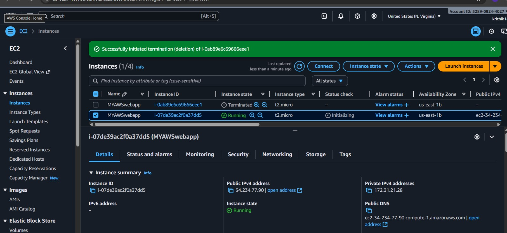
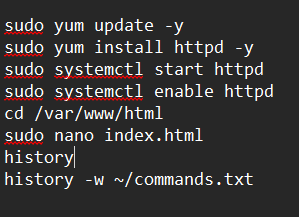
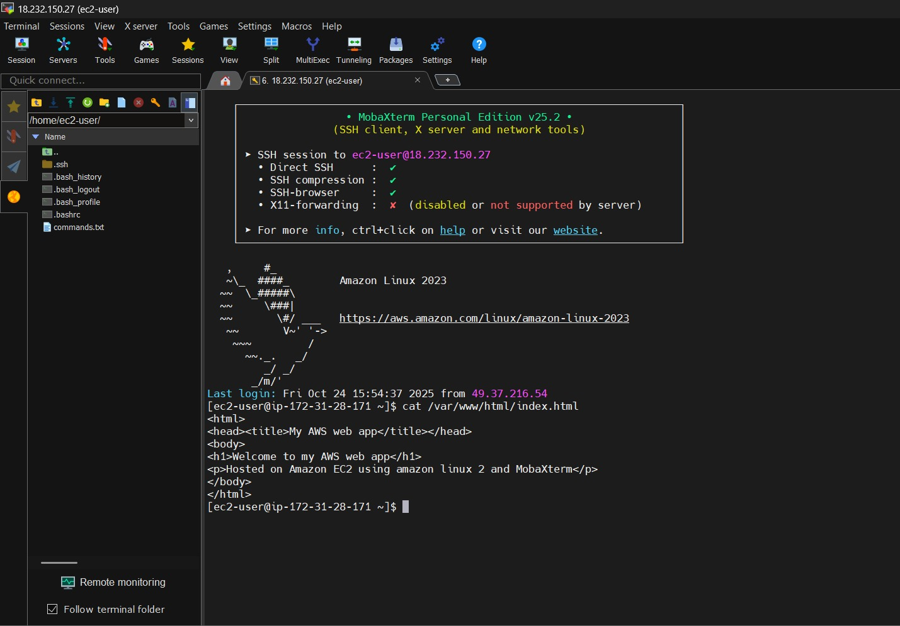
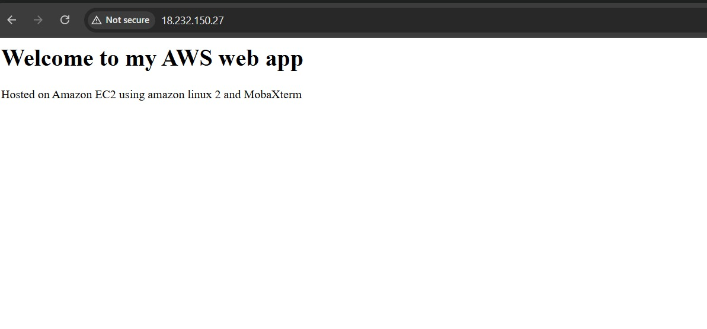

# AWS EC2 Web App — Simple Project 

Deployed a simple web app on Amazon EC2 (Amazon Linux 2) and verified with screenshots.

## Screenshots

### EC2 Dashboard

### MobaXterm Terminal (commands)

### Simple Html Code

### Browser Output (web page)

## Command history
See `commands.txt` for the exact commands used during setup.

---
Completed by: Krithik

